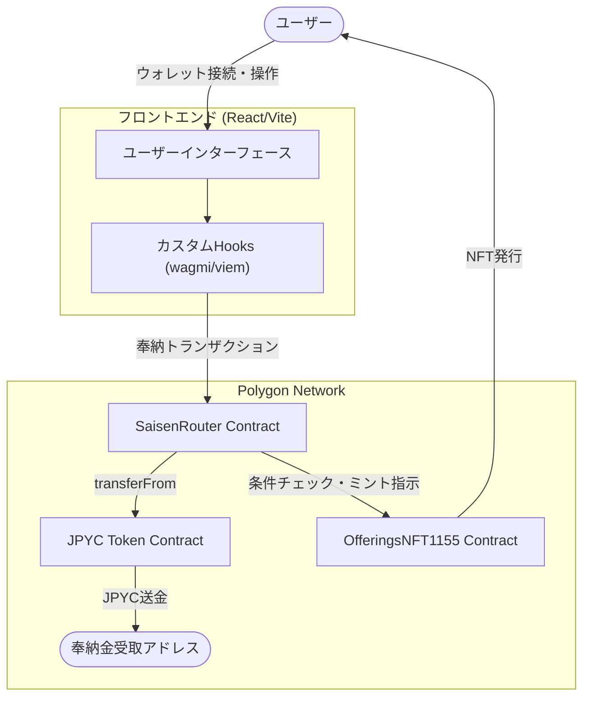
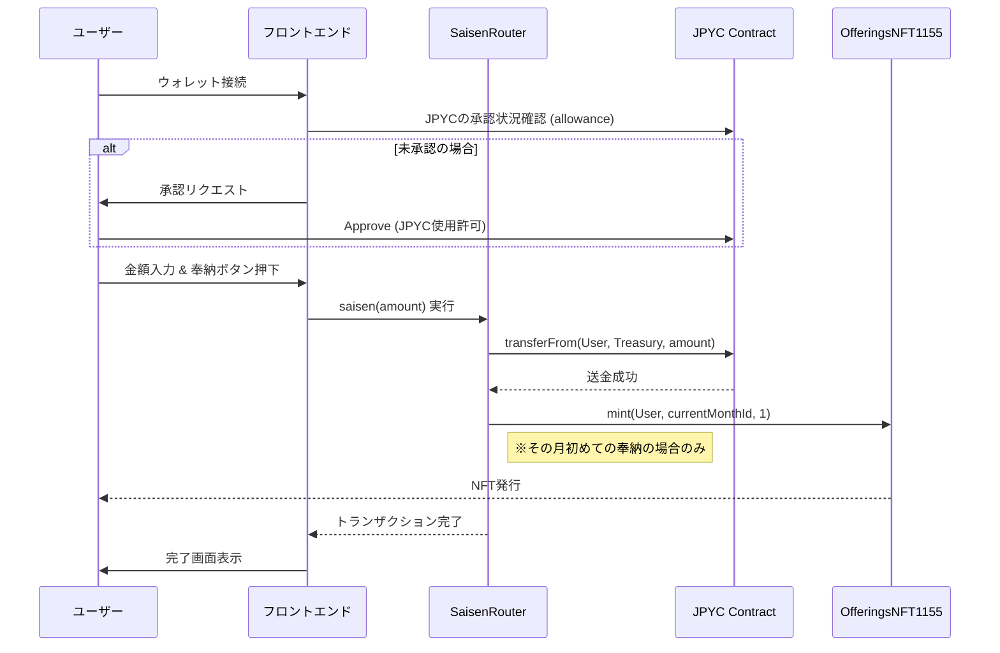

# Osaisen (デジタルお賽銭箱)

Polygonネットワーク上でJPYCを使用したデジタルお賽銭を行い、毎月の参拝記念としてNFTを受け取ることができるdAppです。

## 概要

このプロジェクトは、デジタル奉納を可能にするシステムです。
ユーザーはJPYCをお賽銭として奉納し、その月の最初の奉納時に記念NFT（ERC1155）を受け取ることができます。

**主な機能:**
*   **JPYCによる奉納:** 115 JPYC以上のお賽銭を奉納可能。
*   **月次NFT報酬:** 毎月、最初の奉納時にその年月（例: 202501）に対応した限定NFTをミント。
*   **ガスレス取引:** Account Abstraction (ERC-4337) 対応を見据えた設計（現在Paymaster連携を想定）。

## アーキテクチャ

システム全体の構成図です。



## ユーザーフロー

お賽銭を奉納する際の流れです。



## 技術スタック

### Smart Contracts
*   **Language:** Solidity
*   **Framework:** Hardhat
*   **Libraries:** OpenZeppelin (ERC20, ERC1155, AccessControl)
*   **Network:** Polygon Amoy (Testnet), Polygon Mainnet

### Frontend
*   **Framework:** React + Vite
*   **Language:** TypeScript
*   **Styling:** Tailwind CSS, Framer Motion
*   **Web3 Libraries:** Wagmi, Viem, TanStack Query

## セットアップ手順

ローカル環境での開発・実行方法です。

### 1. リポジトリのクローン & インストール

```bash
git clone <repository-url>
cd osaisen
npm install
```

### 2. スマートコントラクトの準備

```bash
# コンパイル
npm run compile

# テスト実行
npm run test
```

### 3. ローカルノードの起動 (オプション)

ローカルでコントラクトをデプロイしてテストする場合:

```bash
# 別のターミナルで実行
npm run node

# セットアップスクリプトの実行 (Mockトークンのデプロイなど)
npm run dev:setup
```

### 4. フロントエンドの起動

```bash
cd frontend
npm install
npm run dev
```

ブラウザで `http://localhost:5173` にアクセスしてください。

## 環境変数

プロジェクトルートおよび `frontend/` ディレクトリにある `.env.example` を参考に、必要な環境変数を設定してください。
主にデプロイ時の秘密鍵や、RPC URLなどが必要です。

## デプロイ

```bash
# Amoyテストネットへのデプロイ
npm run deploy:amoy

# メインネットへのデプロイ (注意して実行してください)
npm run deploy:mainnet
```